# MediVault Class Diagram

This class diagram outlines the N-Tier architecture of the MediVault application, detailing the flow between Controllers, Services, Repositories, and the underlying Domain Models.

```mermaid
classDiagram
    %% Controllers -> Services Relationships
    AuthController --> AuthService
    UserController --> UserService
    RecordController --> RecordService
    AppointmentController --> AppointmentService
    DocumentShareController --> DocumentShareService
    
    %% Services -> Repositories Relationships
    UserService --> UserRepository
    RecordService --> MedicalRecordRepository
    AppointmentService --> MedicalRecordRepository
    DocumentShareService --> DocumentRepository
    DocumentShareService ..> AccessStrategy : uses
    
    %% Models Relationships
    User "1" --> "0..*" MedicalRecord : owns
    User "1" --> "0..*" Appointment : participates
    MedicalRecord "1" --> "0..*" MedicalDocument : contains
    MedicalDocument "1" --> "0..*" DocumentShare : shared
    MedicalDocument "1" --> "0..*" DocumentAccessLog : logs
    
    %% CONTROLLERS
    class AuthController {
        +String login(String email, String password)
        +void register(String name, String email, String password)
        +void logout(String token)
    }

    class UserController {
        +User getProfile(String userId)
        +void updateProfile(String userId, String name, String email)
    }

    class RecordController {
        +void uploadRecord(String patientId, String doctorId, String diagnosis)
        +List~MedicalRecord~ getRecords(String patientId)
    }

    class AppointmentController {
        +void schedule(String patientId, String doctorId, Date date)
        +List~Appointment~ getAppointments(String userId)
    }

    class DocumentShareController {
        +void grantAccess(String documentId, String userId)
        +void revokeAccess(String shareId)
    }

    %% SERVICES
    class AuthService {
        +User registerUser(String name, String email, String password)
        +String authenticateUser(String email, String password)
        +String generateToken(User user)
    }

    class UserService {
        +User getUserDetails(String userId)
        +void updateUserRole(String userId, String role)
    }

    class RecordService {
        +MedicalRecord createRecord(String patientId, String doctorId, String diagnosis)
        +List~MedicalRecord~ fetchPatientRecords(String patientId)
    }

    class AppointmentService {
        +Appointment bookAppointment(String patientId, String doctorId, Date date)
        +List~Appointment~ getDoctorSchedule(String doctorId)
        +void cancelAppointment(String appointmentId)
    }

    class DocumentShareService {
        +void shareDocument(String documentId, String userId, String permissions)
        +void revokeShare(String shareId)
        +Boolean validateAccess(String documentId, String userId)
    }

    %% INTERFACE
    class AccessStrategy {
        <<Interface>>
        +Boolean checkPermission(String permissions, String action)
    }

    %% REPOSITORIES 
    class UserRepository {
        +User findById(String id)
        +User findByEmail(String email)
        +void save(User user)
        +void delete(String id)
    }

    class MedicalRecordRepository {
        +List~MedicalRecord~ findByPatient(String patientId)
        +void save(MedicalRecord record)
        +void update(MedicalRecord record)
    }

    class DocumentRepository {
        +void saveDocumentUrl(String recordId, String url)
        +List~MedicalDocument~ findByRecordId(String recordId)
        +void deleteDocument(String documentId)
    }

    %% MODELS
    class User {
        -String id
        -String name
        -String email
        -String passwordHash
        -String role
        +Boolean verifyPassword(String password)
        +void updateProfile(String name, String email)
    }

    class MedicalRecord {
        -String id
        -String patientId
        -String doctorId
        -String diagnosis
        -String treatment
        -Date date
        +void updateRecord(String diagnosis, String treatment)
        +String getDetails()
    }

    class MedicalDocument {
        -String id
        -String recordId
        -String fileUrl_Cloudinary
        -String format
        -int size
        +String generateDownloadLink()
    }

    class Appointment {
        -String id
        -String patientId
        -String doctorId
        -Date appointmentDate
        -String status
        -String notes
        +void confirm()
        +void cancel()
        +void reschedule(Date newDate)
    }

    class DocumentShare {
        -String id
        -String documentId
        -String sharedWithUserId
        -String permissions
        -Date expiryDate
        +Boolean isExpired()
        +void revokeAccess()
    }

    class DocumentAccessLog {
        -String id
        -String documentId
        -String accessedByUserId
        -Date timestamp
        -String action
        +void logAction(String action)
    }
```

